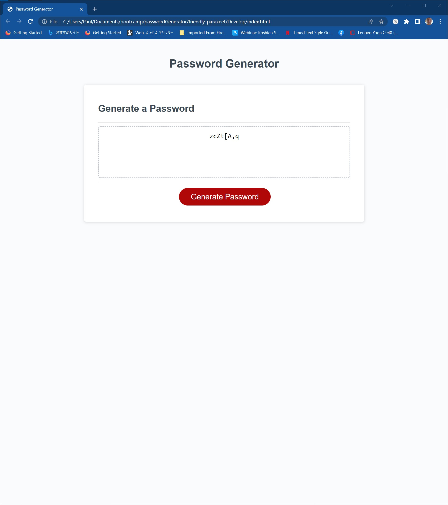

# Password Generator Starter Code

## Description

A password generator designed to generate passwords from 8 to 128 characters using one to four character sets (upper case, lower case, numeric, and special characters.)

## Location

The site is live at the following URL:
[https://pk50sshowa.github.io/passwordGenerator/](https://pk50sshowa.github.io/passwordGenerator/)

## Screenshots

## Developer Comments

Prompts for the password length and desired character sets are given through window alerts.
The generated password itself is also shown through a window alert is written to the main window.

## Contributing

Please take a look at the code history at this project's repo page:
[https://github.com/pk50sshowa/passwordGenerator](https://github.com/pk50sshowa/passwordGenerator)

## Support

Any questions can be directed to the developer at paul.koehler@gmail.com

## Credits

Special thanks to separate consultations with Diarmiud Murphy, Susann Orosco, Mauricio Ortiz, and Meg Meyers.

## License

[MIT](https://choosealicense.com/licenses/mit/)